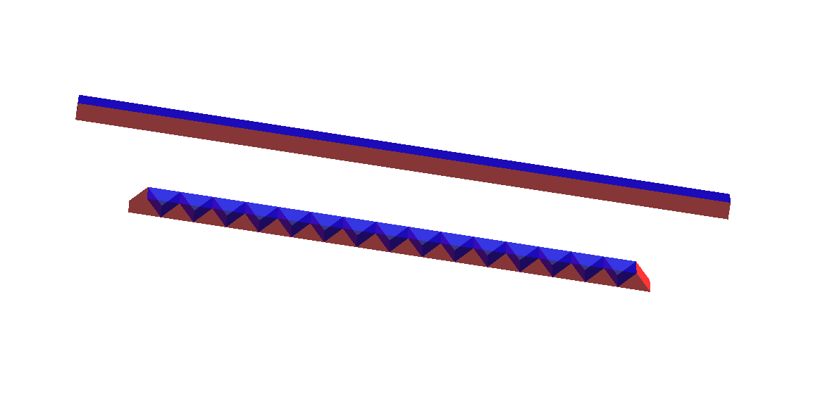
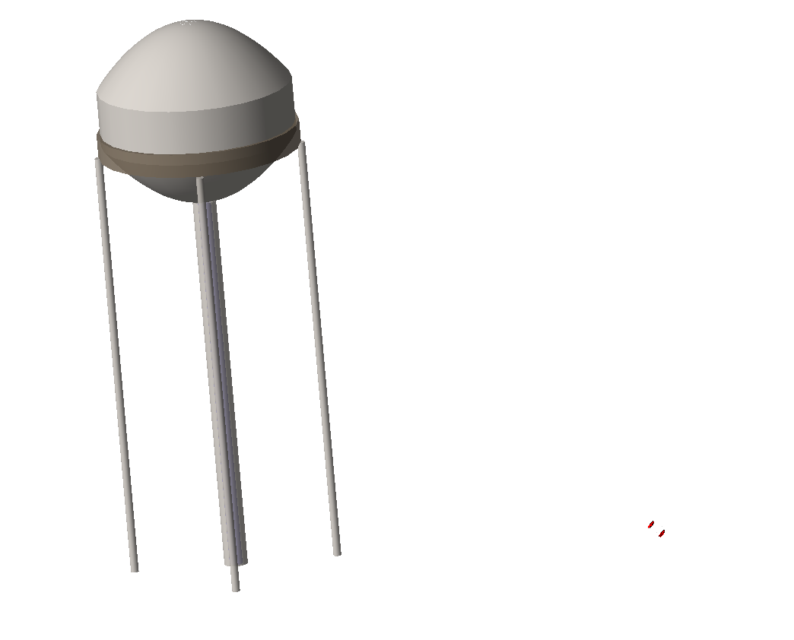
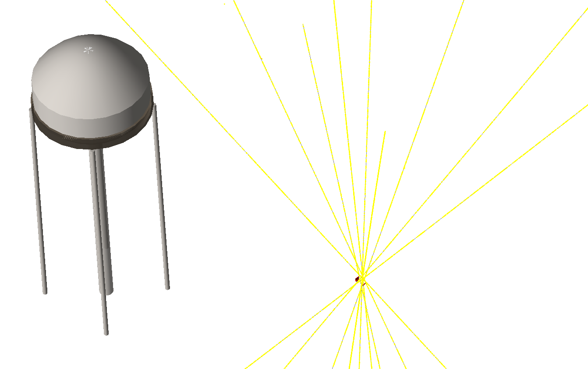

# Geant4 Program for Simulating the Water Tower Imaging Experiment and Testing the latest Prototype Design

### Current version: This configuration has the prototype 2 muon telescope with the latest water tower geometry

This directory has all the C++, ROOT, and GEANT4 code needed for the Monte Carlo simulation of our Muon Detector and the Water Tower at Reese Technology Center. There also the C++ code for the Muon Image and Track Analysis.

## EXPERIMENTAL OVERVIEW:
   
The High Energy Physics Group, led by Dr. Shuichi Kunori at Texas Tech University, has created a portable prototype
muon ray telescope which in the experiment is used to measure the muon flux at any given angle. Our experiment concerns with
the use of this telescope to create tomographical images; we point the telescope towards a Water Tower located at the Reese 
Technology Center and record the muon flux for a period of time. Using this data and the known behavior of muon physics, we 
generate a shadow image of the water tower. This image gives us information of the structural integrity of the water tower, 
which basically means we can infer the different materials used in the construction of the tower and the level of water inside 
the tower.

## PURPOSE OF MONTE CARLO:

The purpose of this program is to create a Monte Carlo simulation of this experiment. The program uses input from the 
Cosmic-Ray Shower Generator (CRY) module and processing engines from CERN's ROOT and GEANT4 libraries to recreate the 
experimental set up. The result of our program gives us insight about the efficiency of our muon telescope and test the 
integrity of our experimental data. We are constantly simulating different test cases for our simulation to learn more on how 
to make muon tomography more efficient and test out different materials and design to make a telescope with higher spatial 
resolution.


# RUNNING THE PROGRAM:

## To compile and run interactively:
* Download the repository.
* Import CRY variables
    * Download the CRY files and remember the installation directory
* Execute the environmnet variables
```bash
. muonSetup.sh
```
* Go into the build directory
```bash
cd build/
```
* Delete everything inside build directory
```bash
rm *
```
* Compile the source code
```bash
cmake ..
```
* Make executable
```bash
make
```
* Execute the program to start the simulation
```bash
./exampleb4a
```
## To start sim:
```bash
cd /sim/build
./exampleb4a
```

## To run batch job:
* Import CRY variables
* cd into the sim directory
```bash
cd sim\
```
* Execute the environmnet variables
```bash
. muonSetup.sh
```
* run the following shell script
```bash
. run_batch.sh
```

# Prototype 2
Image showing prototype 2 design.



## Parameters:

Number in each tray: 16

Dimensions: base 30 mm, 2.6 mm diameter hole

4 layer structure (xy + xy) similar to prototype-1

Total area of tray: 60 x 60 cm^2

# Issues/To Do

- [ ] There seems to be an error with coordinate range for xyatZ 2D histograms, so further analysis is being conducted. -> rp code errors (problem in analysis file)
- [ ] Need to create output file
- [ ] Create output file, finish event reconstruction code
- [ ] Readout of events need to be implemented in analysis code
- [ ] New logic for scintillator arrangement needs to implemented

# Interactive Simulation 
Some example pictures showing the water tower, the telescope and the muon shower in the interactive simulation.





